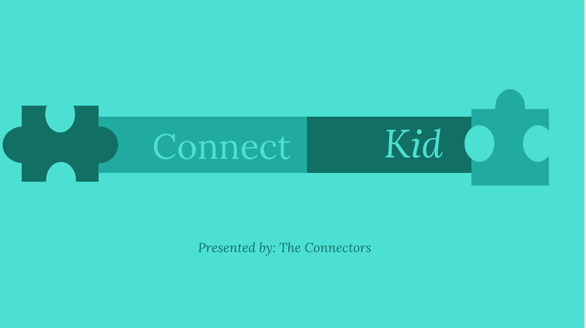

# DreamPortfolio

## Description

Portfolio of Sabrina Carrion's Software Development work throughout the course of the bootcamp.
Utilizied React-bootstrap for design and React Native.

### Problems

- Deploying to Heroku
- Implementing favIcons, some of them were not free.
- Enlarging background created from my own sketch.

### Solutions

- Deployed via GitHub
- Deployed with live site linked below
- Brainstorming on how to resolve issues with background and looking for independent icon for email.
- In search of additional libraries and intend on using semantic.

## Link to Application

[Sabrina Carrion Portfolio](https://www.sabrinacarrion.com)

## Images

